# 2020_OO_11
### 組別:第11組
### 小組成員:
- 組長:林甄瑩
- 組員:蔡昕潔
### 工作分配:
- 企劃:林甄瑩
- 美編:蔡昕潔
### 題目:
Unity遊戲
### 內容:
製作一款2D打怪遊戲，玩家需要控制方向鍵以及攻擊鍵幫助兔媽媽打倒怪物取得胡蘿蔔帶回家中給兔寶寶。
### 甘特圖:
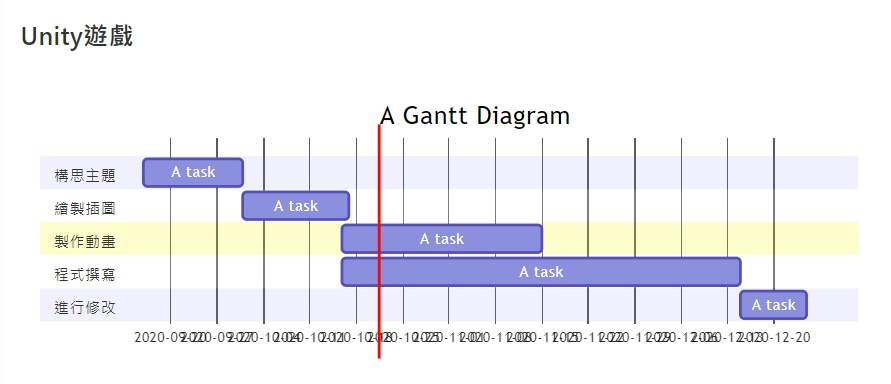
### CPM圖:
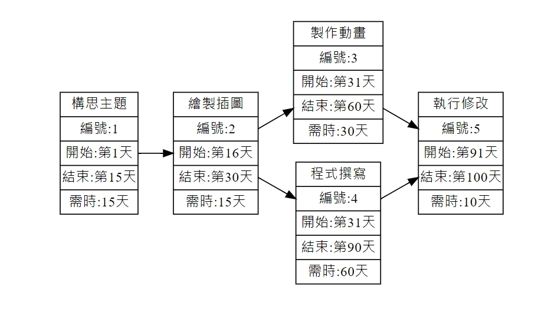
### 功能性需求:
1. 遊戲故事背景及發展可以讓使用者清楚了解。
2. 遊戲介面讓使用者操作起來簡單且明瞭。
3. 使用者可以進行存檔，下次遊玩時方便讀取紀錄。
### 非功能性需求:
1. 反應時間：系統可以對於使用者做的動作快速的執行並做出反應。
2. 可靠度：系統對於使用者所做出的動作執行正確的反應。
3. 維護性：系統增進相關項目的維護。
### 功能分解圖:
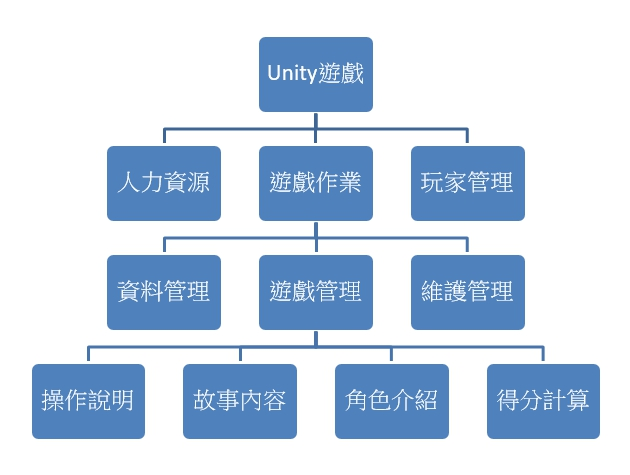
### 使用案例圖:
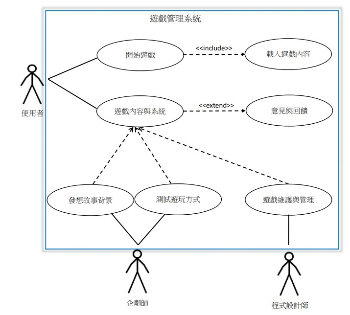
### 遊戲管理系統需求分析簡述如下：
1. 程式設計師可以對遊戲進行維護及管理
2. 企劃師對遊戲進行開發與設計
3. 企劃師要發想遊戲故事背景
4. 企劃師可以測試遊戲遊玩方式
5. 使用者可以載入遊戲進行遊玩
6. 假設使用者提供意見與回饋，遊戲系統要進行紀錄
### 使用案例說明:
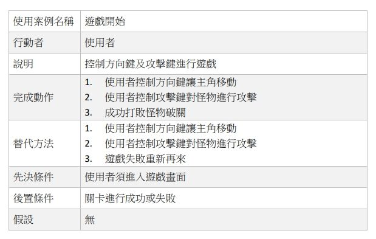
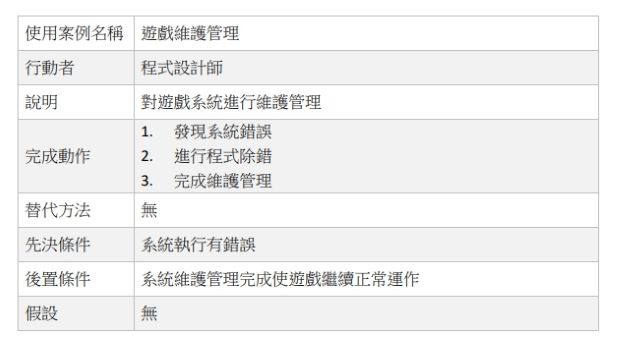
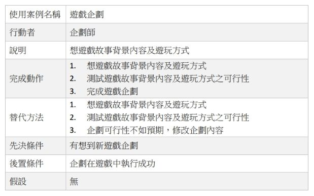
### 系統環境圖 (DFD):
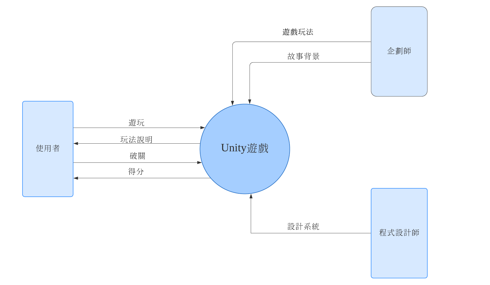
### DFD 圖0:
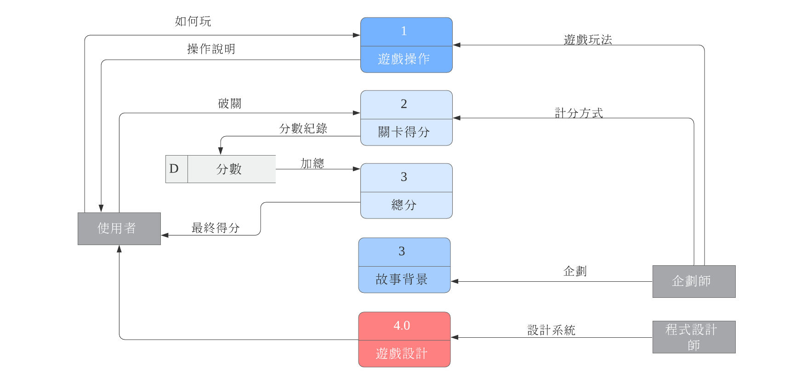
### UML類別圖：
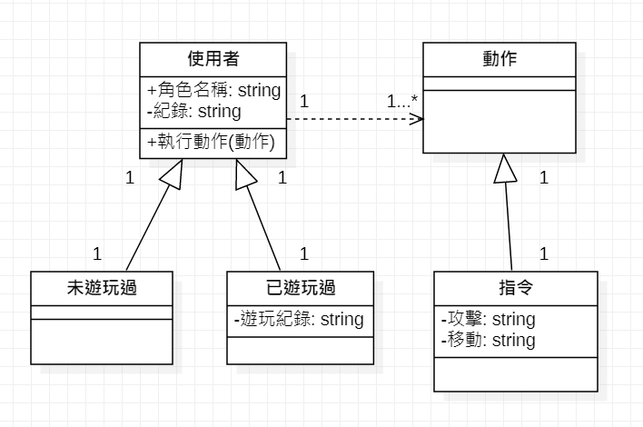
### 循序圖1:
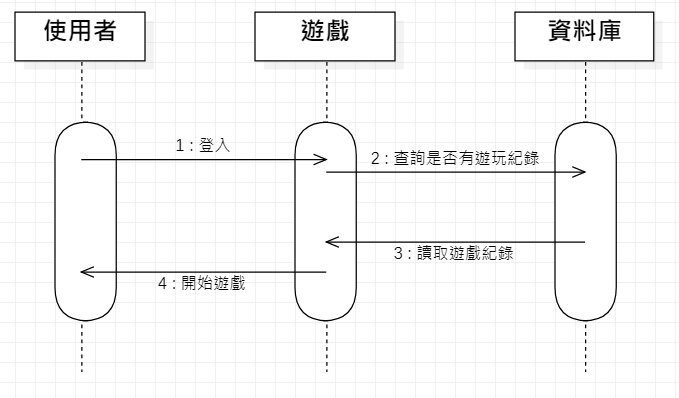
### 活動圖1:

### 循序圖2:
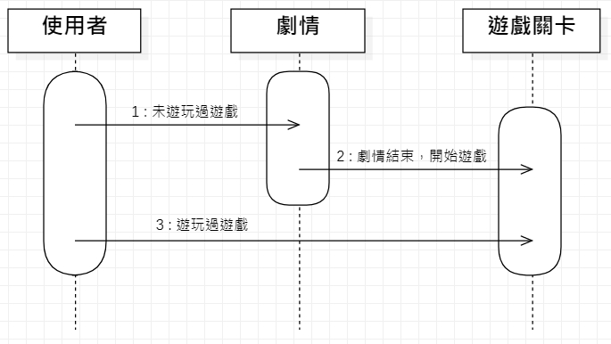
### 活動圖2:
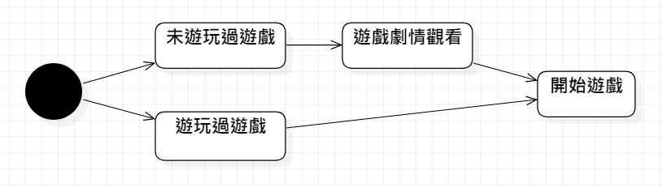
### 循序圖3:
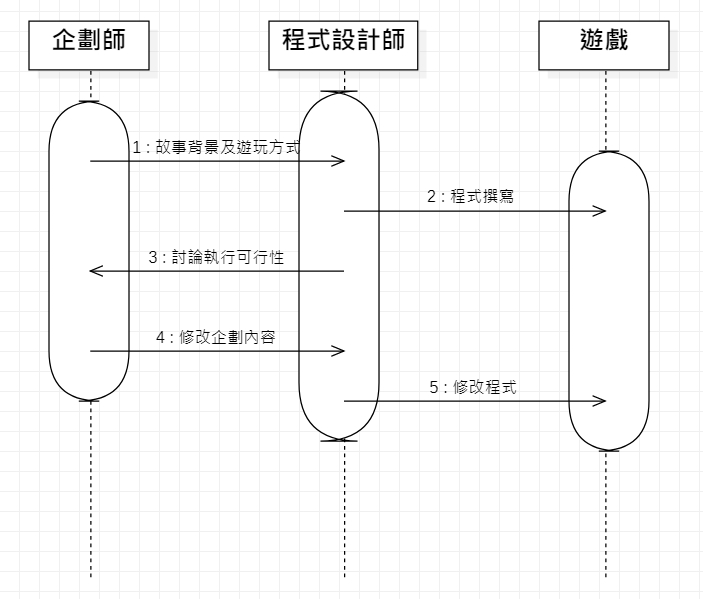
### 活動圖3:
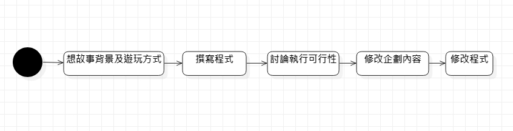
### 分鏡板:
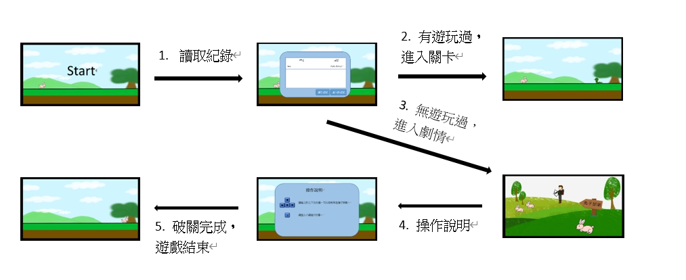
|欄位名稱|資料名稱|資料型態|驗證規則|
|:-----:|:-----:|:-----:|:------:|
|帳號|1st|1st||
|密碼|2nd|2nd||
