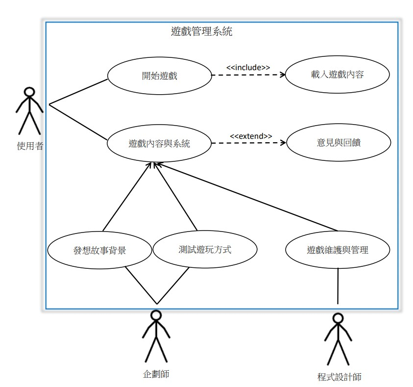

# 2020_OO_11
### 組別:第11組
### 小組成員:
- 組長:林甄瑩
- 組員:蔡昕潔
### 工作分配:
- 企劃:林甄瑩
- 美編:蔡昕潔
### 題目:
Unity遊戲
### 內容:
製作一款2D打怪遊戲，玩家需要控制方向鍵以及攻擊鍵幫助兔媽媽打倒怪物取得胡蘿蔔帶回家中給兔寶寶。
### 甘特圖:

### CPM圖:

### 功能性需求:
1. 遊戲故事背景及發展可以讓使用者清楚了解。
2. 遊戲介面讓使用者操作起來簡單且明瞭。
3. 使用者可以進行存檔，下次遊玩時方便讀取紀錄。
### 非功能性需求:
1. 反應時間：系統可以對於使用者做的動作快速的執行並做出反應。
2. 可靠度：系統對於使用者所做出的動作執行正確的反應。
3. 維護性：系統增進相關項目的維護。
### 功能分解圖:

### 使用案例圖:
### 
### 使用案例說明:

